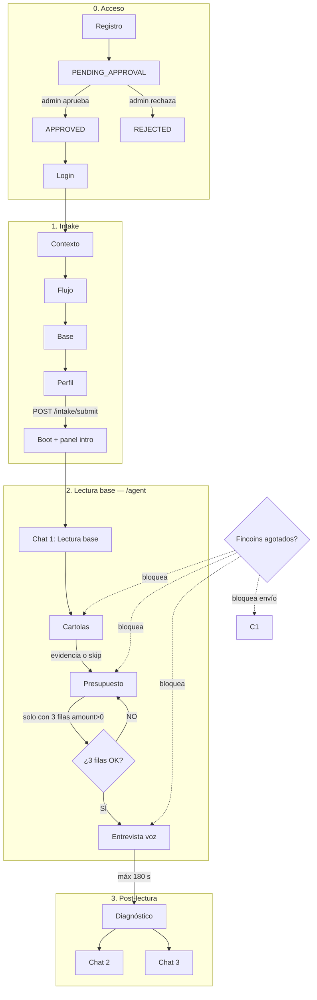
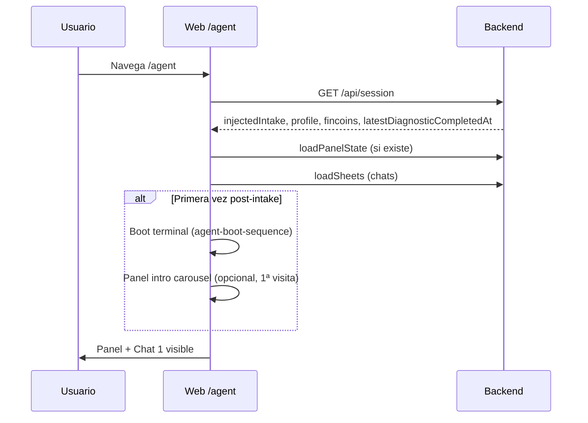
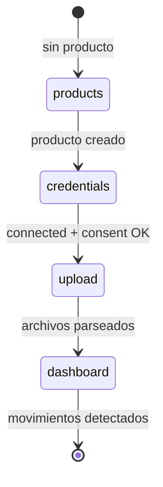
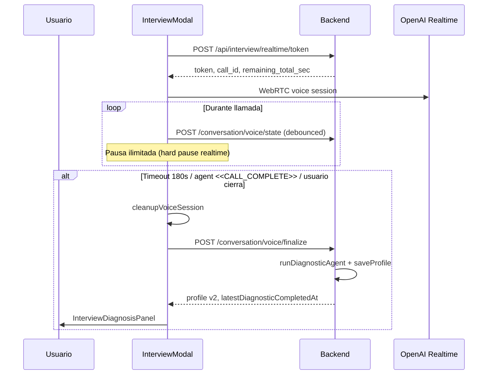
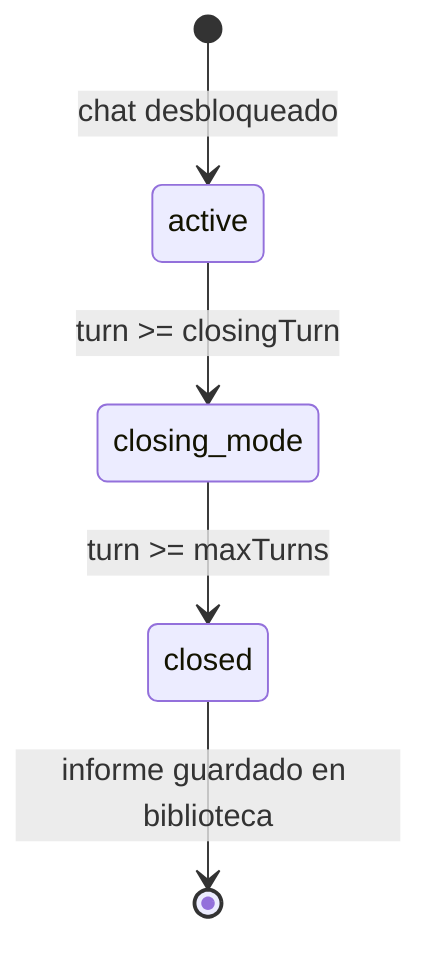
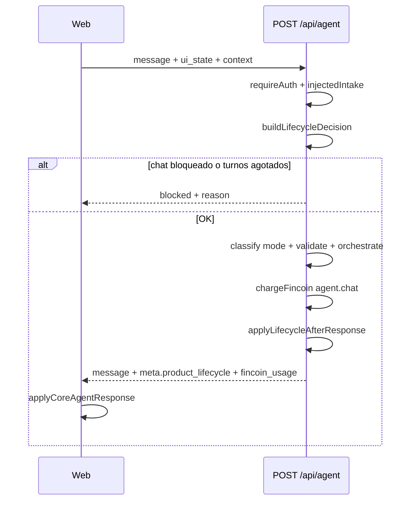

# Flujo end-to-end — Financial Agent

Documento de referencia del recorrido completo del usuario, desde registro hasta cierre de los tres chats. Describe **qué ocurre**, **en qué orden**, **qué desbloquea cada paso** y **qué persiste en backend**.

**Fuente de verdad por capa:**

| Capa | Responsabilidad |
|------|-----------------|
| **UI (`apps/web`)** | Gates visibles, modales, copy del funnel, validación inmediata |
| **API lifecycle** | Fases del producto, unlock de chats, turnos, directivas al agente |
| **Persistencia** | Prisma (usuario, sesión, perfil) + JSON en `User` + panel state |

Cuando UI y API difieren, este doc marca ambos comportamientos.

**Límites del sistema (MCP):** el agente entrega orientación y análisis mediante herramientas MCP de lectura, consulta y simulación controlada. No ejecuta transacciones ni reemplaza asesoría profesional. Cuando aplique, preferir fuentes oficiales y citar evidencia en las respuestas.

---

## Reglas invariantes de producto

Estas tres reglas son **no negociables** y prevalecen sobre copy suelto en UI o interpretaciones ambiguas:

| # | Regla | Implementación |
|---|-------|----------------|
| 1 | **Lectura base** agrupa **cartolas** y **presupuesto** | Tras el intake, el usuario entra en Lectura base: trabaja evidencia transaccional y presupuesto desde Chat 1 y el panel. No es una etapa separada de esos módulos. |
| 2 | **Entrevista se desbloquea únicamente** con **≥3 filas de presupuesto con `amount > 0`** | Sin las 3 filas, el panel de entrevista, el CTA y `canOpenInterview` permanecen bloqueados. Evidencia de cartolas (o skip) es prerequisito previo para abrir presupuesto, pero **no sustituye** las 3 filas. |
| 3 | **Duración máxima de entrevista: 3 minutos (180 segundos), sin excepción** | Cuota hard por usuario (`INTERVIEW_TOTAL_LIMIT_SEC = 180`). Al llegar a 180 s la llamada termina. No hay extensión manual ni segunda llamada. |

---

## Mapa general



**Orden canónico del producto (no negociable en UI):**

```
Intake → Lectura base (cartolas + presupuesto) → Entrevista (máx. 3 min / 180 s) → Diagnóstico → Chats 2 y 3
```

Dentro de **Lectura base**, el orden interno es: cartolas/evidencia → presupuesto hasta **exactamente 3 filas con monto**. La entrevista **no** forma parte de Lectura base.

**Excepción documentada:** el usuario puede **omitir cartolas** (`productsModuleSkipped`), lo que satisface la etapa de evidencia sin movimientos analizados.

---

## Fase 0 — Registro, aprobación y sesión

### 0.1 Registro

| Paso | Pantalla / acción | API | Resultado |
|------|-------------------|-----|-----------|
| 1 | Usuario completa registro (email, password) | `POST /auth/register` | Usuario creado con `approvalStatus: PENDING_APPROVAL` |
| 2 | — | Email a admin con links HMAC approve/reject | Admin puede aprobar sin login |

**Validaciones de password:** 8–128 caracteres, al menos 1 mayúscula y 1 dígito.

### 0.2 Aprobación

| Estado | Login | Redirección web |
|--------|-------|-----------------|
| `PENDING_APPROVAL` | Bloqueado (403) | `/waiting-approval` |
| `REJECTED` | Bloqueado (403) | `/waiting-approval` |
| `APPROVED` | Permitido | Según intake (ver 0.4) |

Admin: `GET /auth/approve?token=` o `GET /auth/reject?token=` (TTL configurable, default 24 h).

### 0.3 Login y sesión

| Paso | API | Reglas |
|------|-----|--------|
| Login | `POST /auth/login` | Invalida sesiones previas del usuario |
| Sesión activa | Cookie httpOnly + CSRF en mutaciones | TTL ~7 días; rotación cada ~30 min |
| Validación | `GET /auth/me`, `GET /api/session` | Sin sesión válida → `/login` |

### 0.4 Enrutamiento post-login

```
¿Sesión válida?
  NO  → /login
  SÍ  → ¿approval OK?
          NO  → /waiting-approval
          SÍ  → ¿intake mínimo? (employmentStatus + incomeBand en injectedIntake)
                  NO  → /intake
                  SÍ  → /agent
```

**Intake “mínimo”** (`hasCompletedIntakeAccess`): solo `employmentStatus` + `incomeBand`.

**Intake “completo”** (`hasMeaningfulIntake`): todos los campos obligatorios del cuestionario + checklist de conocimiento financiero.

---

## Fase 1 — Cuestionario (Intake)

**Ruta:** `/intake`
**Archivos:** `apps/web/app/intake/page.tsx`, steps en `apps/web/app/intake/steps/`

### 1.1 Pasos del wizard

| # | Key | Título | Campos principales | Avance |
|---|-----|--------|-------------------|--------|
| 1 | `context` | Tu contexto personal | edad (14–100), ciudad, empleo, profesión | Botón siguiente cuando campos requeridos del step |
| 2 | `cashflow` | Ingresos y gastos | banda de ingreso CLP, cobertura de gastos, seguimiento de gastos | Requiere `incomeBand`, `expensesCoverage` |
| 3 | `savings` | Ahorro y deudas | tiene ahorro/inversión, banda ahorro, tiene deuda | Booleans obligatorios |
| 4 | `knowledge` | Conocimiento y riesgo | checklist 15 temas (CAE, UF, fintech…), reacción al riesgo, autoevaluación 0–10, estrés 0–10 | Submit final |

**Moneda y locale:** bandas en CLP mensual (`<300k`, `300k-600k`, `600k-1M`, etc.). Tipos en `packages/shared/src/intake/intake-questionnaire.types.ts`.

### 1.2 Submit

| Paso | Acción | API | Efectos |
|------|--------|-----|---------|
| 1 | Usuario confirma paso 4 | `POST /intake/submit` | Valida schema Zod estricto |
| 2 | — | `analyzeIntake()` + `buildIntakeContext()` | Señales derivadas (inestabilidad ingreso, presión deuda, etc.) |
| 3 | — | Persiste en `User.injectedIntake` | Si autenticado: knowledge event `completed_intake` (+20 pts, una vez) |
| 4 | — | Respuesta incluye `readyForInterview: true` | Señal técnica post-intake; **no** desbloquea entrevista (falta cerrar Lectura base: cartolas + 3 filas presupuesto) |
| 5 | Cliente | `setIntake` en `interview.store` (sessionStorage) | Payload local para modal de entrevista |
| 6 | Cliente | `markAgentBootFromIntake()` + `markPanelIntroPendingFromIntake()` | Flags localStorage para boot e intro |
| 7 | Redirect | `router.push('/agent')` | Entrada al hub principal |

**Bootstrap de `/intake`:** si ya tiene intake mínimo → redirect a `/agent` sin repetir wizard.

---

## Fase 2 — Lectura base (`/agent`)

**Qué es Lectura base:** período posterior al intake en el que el usuario **integra evidencia financiera** trabajando **cartolas** y **presupuesto**. Ocurre en `/agent` con Chat 1 activo en modo “Lectura base en curso”. Cartolas y presupuesto no son fases posteriores a Lectura base: **son Lectura base**.

**Qué NO es Lectura base:** la entrevista por voz. La entrevista es la **siguiente fase** y solo se desbloquea al cerrar Lectura base (3 filas de presupuesto cumplidas).

**Archivo principal:** `apps/web/app/agent/page.tsx`

### 2.1 Secuencia de arranque



### 2.2 Qué ve el usuario al entrar (inicio de Lectura base)

| Elemento | Estado inicial | Notas |
|----------|----------------|-------|
| **Chat 1** | Siempre desbloqueado | Modo **Lectura base** mientras duren cartolas y presupuesto |
| **Chats 2 y 3** | Bloqueados en UI | Hasta `latestDiagnosticCompletedAt` en sesión |
| **Panel — Productos y transacciones** | Desbloqueado | Primera sub-etapa de Lectura base |
| **Panel — Presupuesto** | Bloqueado | Segunda sub-etapa; requiere evidencia TX o skip |
| **Panel — Entrevista** | Bloqueado | **Solo** se desbloquea con ≥3 filas `amount > 0` (ver §2.3) |
| **CTA en chat** | Según `buildOnboardingFlowCta` | Guía dentro de Lectura base: cartolas → presupuesto |

### 2.3 Estados UX de Chat 1 y cierre de Lectura base

| Estado | Condición | Copy principal | Fase |
|--------|-----------|----------------|------|
| `baseReading` | Lectura base en curso: falta evidencia TX **o** faltan filas de presupuesto (<3 con monto) | “Lectura base en curso” | **Lectura base** (cartolas + presupuesto) |
| `interviewAvailable` | Lectura base **cerrada**: evidencia TX (o skip) **y** ≥3 filas presupuesto con monto, sin diagnóstico | “Entrevista disponible” | Fin de Lectura base; entrevista desbloqueada |
| `diagnosisCompleted` | `latestDiagnosticCompletedAt` set | “Chat general” | Post-entrevista |

**Gate de entrevista (regla dura):**

```
canOpenInterview =
  interviewCompleted
  OR (
    isTransactionsEvidenceSatisfied(products, skip)
    AND budgetRows.filter(r => r.amount > 0).length >= 3
  )
```

Sin **3 filas con monto > 0**, la entrevista **no se abre** aunque cartolas estén completas. Código: `apps/web/app/agent/page.tsx` (`canOpenInterview`), `BUDGET_ROWS_TARGET = 3` en `onboarding-flow.helpers.ts`.

Lógica UX Chat 1: `apps/web/app/agent/page.utils.ts` → `resolveChat1UxState`.

### 2.4 Sub-etapas de Lectura base

| Sub-etapa | Sección doc | Criterio de salida |
|-----------|-------------|-------------------|
| **Cartolas** | §2.5 | Evidencia analizada **o** `productsModuleSkipped` |
| **Presupuesto** | §2.6 | **≥3 filas con `amount > 0`** (obligatorio para desbloquear entrevista) |

Lectura base termina cuando ambas sub-etapas cumplen su criterio de salida.

### 2.7 Sincronización de contexto financiero

Mientras el usuario trabaja en panel:

| Dato local | Destino remoto | Trigger |
|------------|----------------|---------|
| `bankSimulation` (productos, skip) | `injectedIntake.productsContext` | `mergeProductsContextToIntake` (debounce ~600 ms) |
| `budgetRows`, respuestas budget chat | `injectedIntake.budgetContext` | Mismo merge |
| Panel completo | `panelState` en API + backup localStorage | Debounce ~1.2 s |

El agente recibe este contexto en cada `POST /api/agent` vía `buildCoreAgentContext`.

---

### 2.5 Cartolas — productos y transacciones

*Sub-etapa de Lectura base.*

**Modal:** `TransactionsModal`
**Helpers:** `apps/web/lib/transactions-flow.helpers.ts`, `apps/web/app/agent/transactions/`

#### Criterios de completitud (UI)

| Flag | Condición | Función |
|------|-----------|---------|
| `productsCompleted` | ≥1 producto creado **o** `productsModuleSkipped` | `isProductsStepSatisfied` |
| `transactionsCompleted` | Movimientos analizados **o** skip | `isTransactionsEvidenceSatisfied` |
| Evidencia real | OCR/parsing con `movement_count > 0` | `productHasAnalyzedMovements` |

**Skip:** `continueWithoutProducts()` → `productsModuleSkipped: true` → desbloquea presupuesto sin cartolas.

#### Wizard interno por producto



| Step (`resolveTxWizardStep`) | UI stage | Requisito |
|------------------------------|----------|-----------|
| `products` | — | Elegir banco + plantilla (Cuenta RUT, APV, etc.) |
| `credentials` | Autorización | Banco no genérico + `simulationAccepted === true` |
| `upload` | Evidencias | Subir PDF/imagen/Excel (sin video) |
| `dashboard` | Resumen / analista | Al menos un documento parseado |

Instituciones del catálogo chileno se etiquetan `(simulacion)` — **no hay conexión bancaria real**.

#### Sub-flujo de consentimiento

`deriveTransactionAuthorizationState` exige:

1. Banco seleccionado (no vacío)
2. Label distinto de placeholder (`Producto N`)
3. `simulationAccepted === true` (Open Finance simulado)

#### Límites operativos

| Límite | Valor |
|--------|-------|
| Productos activos | 7 |
| Productos creados (lifetime) | 12 |
| Archivos evidencia / producto | 25 |
| Resets de evidencia / producto | 3 |
| Archivo individual | 10 MB |
| Batch total | 50 MB |

#### Parseo y chat auxiliar

| Acción | API | Costo Fincoin |
|--------|-----|---------------|
| Parse documento | `POST /api/documents/...` | `document.parse` (USD 0.06) |
| Preguntas sobre movimientos | `POST /api/transactions-chat` | `transactions.chat` (USD 0.03) |

#### Experiencia post-upload

`resolveAnalystExperienceState` elige:

- **Dashboard analista completo** — muchos movimientos, buena confianza OCR
- **Chat resumen mínimo** — pocos movimientos, fotos/texto, baja confianza

#### Transición a sub-etapa Presupuesto

```
transactionsCompleted === true
  → budgetUnlocked === true
  → CTA cambia a "Completar presupuesto"
  → Panel presupuesto deja de estar locked (si hay Fincoins)
  → Usuario sigue en Lectura base (Chat 1: baseReading)
```

---

### 2.6 Presupuesto

*Sub-etapa de Lectura base. Cierra Lectura base solo al cumplir las 3 filas.*

**Modal:** `BudgetModal`
**Target:** `BUDGET_ROWS_TARGET = 3` filas con `amount > 0`

#### Gates

| Gate | Condición |
|------|-----------|
| Abrir modal | `budgetUnlocked` + Fincoins disponibles |
| Completar sub-etapa presupuesto | `budgetRowsCompleted >= 3` (filas con `amount > 0`) |
| **Desbloquear entrevista** | **Únicamente** `budgetRowsCompleted >= 3` (+ evidencia TX o skip ya cumplida). No hay atajo. |

#### Comportamiento del modal

| Evento | Comportamiento |
|--------|----------------|
| Apertura con filas vacías | Auto-aplica plantilla starter |
| Chat de presupuesto | No inicia hasta existir al menos una fila |
| Máximo filas | `MAX_BUDGET_ROWS` (30, shared) |
| Acciones tabla | Máx. 30 por request |

#### Chat auxiliar de presupuesto

| API | Límite | Costo |
|-----|--------|-------|
| `POST /api/budget-chat` | Pregunta ≤500 chars, respuesta ≤1200 | `budget.chat` (USD 0.03) |

**Orquestación (ReAct básico):** `runBudgetChatAgent` → loop de hasta **2 iteraciones** (`BUDGET_CHAT_REACT_MAX_ITERATIONS`):

1. Herramientas de lectura/análisis: `budget__table_snapshot`, `budget__analyze_health`, `finance__budget_analyzer` (MCP).
2. Cierre obligatorio: `budget__complete_turn` con `actions` validadas (`validateBudgetTableActions`).
3. Fallback si falla o timeout: llamada structured single-shot legacy.

Desactivar: `BUDGET_CHAT_REACT_ENABLED=false`. Archivos: `budget-chat-react.service.ts`, `budget-chat-react.tools.ts`.

#### Persistencia

Filas y totales → `panelState` + `budgetContext` en intake merge → visible para entrevista y agente.

#### Cierre de Lectura base y desbloqueo de entrevista

Lectura base **solo** termina cuando:

1. `transactionsCompleted` (evidencia o skip), **y**
2. `budgetRows.filter(row => row.amount > 0).length >= 3`

Entonces:

```
→ canOpenInterview === true
→ Chat 1 UX: interviewAvailable (sale de baseReading)
→ Panel entrevista: "Entrevista disponible"
→ CTA: "Iniciar entrevista" (duración máx. 3 min / 180 s)
```

Si hay cartolas completas pero **menos de 3 filas con monto**, el usuario **permanece en Lectura base** y la entrevista sigue bloqueada.

---

## Fase 3 — Entrevista por voz

**Modal:** `InterviewModal`
**Ruta legacy:** `/interview` → redirect `/agent?openInterview=1`
**Constantes:** `packages/shared/src/interview.constants.ts`

### 3.1 Precondiciones

| Requisito | Detalle |
|-----------|---------|
| Lectura base cerrada | ≥3 filas presupuesto con monto + evidencia TX (o skip) |
| Intake en store/sesión | Bootstrap hidrata intake + `productsContext` + `budgetContext` |
| Fincoins | Bloqueado si depleted |
| Una llamada por usuario | `INTERVIEW_MAX_CALLS_PER_USER = 1` |
| **Duración máxima** | **180 segundos (3 minutos) por usuario — límite absoluto** |

### 3.2 Duración: 3 minutos (180 s), sin excepción

| Constante | Valor | Efecto |
|-----------|-------|--------|
| `INTERVIEW_TOTAL_LIMIT_SEC` | **180** | Techo hard de tiempo activo acumulado por usuario |
| `INTERVIEW_CLOSEOUT_BUFFER_SEC` | 25 | En los últimos 25 s el agente debe cerrar con `<<CALL_COMPLETE>>` |
| `INTERVIEW_MIN_EARLY_END_SEC` | 30 | Cierre anticipado por usuario solo tras ≥30 s activos |
| `INTERVIEW_MAX_CALLS_PER_USER` | 1 | No hay segunda llamada ni extensión de cuota |

Al alcanzar **180 s**, la llamada finaliza automáticamente (`endedBy: timeout`). No existe modo “más tiempo”.

Fuente: `packages/shared/src/interview.constants.ts`, enforced en API (`conversation.ts`) y UI (`useInterviewVoiceRuntime.ts`).

### 3.3 Flujo de la llamada



### 3.4 Estados de voz

| Status | Significado |
|--------|-------------|
| `idle` | Sin llamada activa |
| `in_progress` | WebRTC conectado, mic activo |
| `paused` | Cuota congelada, conexión pausada |
| `completed` | Finalize exitoso |

### 3.5 Reglas de cierre

| Modo | Condición |
|------|-----------|
| **Timeout (regla principal)** | **180 s** de tiempo activo acumulado — corte automático |
| Cierre anticipado usuario | ≥30 s activos (`INTERVIEW_MIN_EARLY_END_SEC`) |
| Cierre agente | `<<CALL_COMPLETE>>` dentro del buffer de 25 s finales |
| Cerrar modal | Permitido excepto durante `connecting` o `finalizing diagnosis` |

**Costo finalize:** `conversation.voice` (USD 0.08) + token realtime `voice.realtime` (USD 0.12).

### 3.6 Bloques de entrevista (backend)

Plan dinámico desde intake (`buildInterviewPlan`):

| Bloque | Siempre | Condicional |
|--------|---------|-------------|
| warmup, cashflow, resilience, products, goals, knowledge, risk, emotional | ✓ | — |
| debt | — | Solo si `hasDebt === true` |

Contrato clínico: `apps/api/src/orchestrator/interview.flow.ts` → `INTERVIEW_CONTRACT`.

### 3.7 Finalize → diagnóstico

`POST /conversation/voice/finalize` payload: intake enriquecido, transcript, minuteSummaries, finalSummary, `endedBy`, `durationSec`, `callId`.

**Pipeline backend:**

1. Valida Fincoins y duración mínima si `endedBy === 'user'`
2. Idempotente por `callId` (re-finalize no duplica perfil)
3. LLM → resumen ejecutivo → evidencia sintética por bloques
4. `runDiagnosticAgent()` → `FinancialDiagnosticProfile` v2
5. Fallback automático si falla el agente
6. `saveProfile` + knowledge event `completed_profile` (+25)
7. Actualiza `memoryBlob.interviewVoice` y timeline

**Retry en UI:** `retryDiagnosisGeneration()` re-ejecuta finalize **sin nueva llamada** si falló la generación.

### 3.8 Señal de completitud

```
sessionInfo.latestDiagnosticCompletedAt !== null
  → interviewCompleted === true
  → onboarding CTA desaparece
  → Chats 2 y 3 desbloqueados en UI
  → API lifecycle phase → diagnosis_ready
```

---

## Fase 4 — Diagnóstico (perfil financiero)

**Lectura:** `GET /diagnosis/latest` o `GET /api/diagnosis/latest`
**Schema:** `apps/api/src/schemas/profile.schema.ts`

### 4.1 Estructura del perfil

| Sección | Contenido |
|---------|-----------|
| `traits` | Claridad financiera, estilo decisión, horizonte, presión |
| `blockEvidence[]` | Por bloque de entrevista: summary, señales, confianza, `userValidated` |
| `interviewMeta` | completeness, blocksExplored, blocksSkipped, completedAt |
| `recommendations` | Orientaciones coherentes con guardrails |
| `riskProfile`, `priorities` | Derivados del agente diagnóstico |

### 4.2 Visualización

- Panel diagnóstico en modal post-entrevista (`InterviewDiagnosisPanel`)
- Perfil en `profile.store` + re-fetch en sesión
- Tarjeta entrevista en panel: badge “Activo” / diagnóstico completado

---

## Fase 5 — Chats del agente (post-intake)

### 5.1 Los tres chats

| ID | Nombre UX | Propósito | Max turnos | Closing mode desde turno |
|----|-----------|-----------|------------|--------------------------|
| `chat-1` | Chat general (post-diagnóstico) | Educación, lectura integrada, preguntas generales | 30 | 24 |
| `chat-2` | Plan de acción | Embudo: brainstorm → convergencia → plan estructurado | 20 | 14 |
| `chat-3` | Conciencia social | Filosofía, finanzas y regulación (CMF/SII) | 10 | 4 |

### 5.2 Unlock de chats

| Fase API | Chats desbloqueados |
|----------|---------------------|
| Antes de diagnóstico | Solo `chat-1` |
| `diagnosis_ready` o `advisory_unlocked` | `chat-1`, `chat-2`, `chat-3` |

**UI adicional:** swipe entre chats en móvil bloqueado hasta diagnóstico.

### 5.3 Ciclo de vida por chat



| Estado | Comportamiento agente |
|--------|----------------------|
| `active` | Respuesta normal según modo clasificado |
| `closing_mode` | Directiva: conducir a conclusión documentable |
| `closed` | Envío bloqueado; informe en `productLifecycle.reports` |

**Títulos de informes guardados:**

- chat-1: “Informe de diagnóstico general”
- chat-2: “Informe de plan de acción e inversiones”
- chat-3: “Informe de conciencia social financiera”

### 5.4 Envío de mensaje



**Requisito duro:** `POST /api/agent` sin `injectedIntake` → `INTAKE_REQUIRED`.

### 5.5 Modos del clasificador (agente)

`education`, `information`, `comparison`, `simulation`, `budgeting`, `planification`, `decision_support`, `regulation`, `containment`

Modos con decisión pesada pasan `validate.phase` (coherencia con perfil).

### 5.6 Fase API vs señales de onboarding

`derivePhase` en `product-lifecycle.service.ts`:

| Fase | Condición |
|------|-----------|
| `intake_review` | Sin intake en contexto |
| `transactions_needed` | Sin señal de transacciones |
| `budget_needed` | Sin señal de presupuesto |
| `interview_needed` | Sin entrevista completada |
| `diagnosis_ready` | Entrevista/diagnóstico OK |
| `advisory_unlocked` | Sticky una vez alcanzado |

**Nota:** la regla de negocio es la UI: **3 filas con monto** para desbloquear entrevista. La API lifecycle puede marcar `hasBudget` con criterios más laxos (ingresos/gastos > 0); eso **no** abre la entrevista en producto.

---

## Fase 6 — Cierre del producto

### 6.1 Por agotamiento de turnos

Cada chat al llegar a `maxTurns`:

1. Se marca en `closedChats`
2. Se genera `closing_summary`
3. Se guarda reporte en biblioteca (máx. 20 en memoria lifecycle)

### 6.2 Por agotamiento de Fincoins

| Efecto | Detalle |
|--------|---------|
| Bloqueo UI | Modales TX, budget, interview; envío chat |
| Backend | `fincoinDepletedAt`; operaciones con costo rechazadas |
| Post-depletion | `ensureFincoinDepletionHandled` → resúmenes de cierre en chats |
| Sheets | Status `active` → `context` |

**Balance:** 250 Fincoins iniciales ≈ USD 1.60 display; techo USD 2.00/usuario.

---

## Tabla maestra — Criterios de completitud

| Etapa | Completitud UI | Señal API / sesión | Desbloquea |
|-------|----------------|-------------------|------------|
| Registro + aprobación | Login exitoso | `approvalStatus: APPROVED` | `/intake` o `/agent` |
| Intake | Submit 4 pasos | `injectedIntake` persistido | `/agent`, inicio Lectura base |
| **Lectura base — cartolas** | Evidencia o skip | `hasTransactions` / skip | Sub-etapa presupuesto (sigue en Lectura base) |
| **Lectura base — presupuesto** | **≥3 filas `amount > 0`** | `budgetContext` | **Entrevista (solo si 3 filas)** |
| Entrevista | Finalize OK en **≤180 s** | `latestDiagnosticCompletedAt` | Diagnóstico + chats 2/3 |
| Diagnóstico | Perfil cargado | `FinancialProfile` en DB | Chats 2/3 (API unlock) |
| Chat N | Turnos = max | `closedChats` incluye N | Solo lectura + informe |

---

## Gates transversales

### Fincoins

| Operación | USD |
|-----------|-----|
| `agent.chat` | 0.04 |
| `budget.chat` | 0.03 |
| `transactions.chat` | 0.03 |
| `document.parse` | 0.06 |
| `voice.realtime` | 0.12 |
| `conversation.voice` | 0.08 |
| `welcome.llm` | 0.02 |

Warning UI cuando `remainingFincoins ≤ 50`.

### Composer del chat principal

Deshabilitado cuando cualquier modal bloqueante está abierto: Transactions, Budget, Questionnaire, Account, Interview, Social Consciousness.

### Acciones de panel desde el agente

`normalizePanelActionForCurrentFlow` reescribe `panel_action` del backend si el usuario aún no cumple prerequisitos (ej. abrir presupuesto sin cartolas → redirige a transacciones).

---

## Knowledge score (paralelo al funnel)

Progresión 0–100 con milestones (`knowledge.service.ts`). **No reemplaza** los locks del funnel; es capa de gamificación/educación.

| Umbral | Feature desbloqueada (label) |
|--------|------------------------------|
| 0 | Acceso básico chat educativo |
| 20 | Cuestionario y perfil |
| 40 | Presupuesto personalizado |
| 55 | Módulo presupuesto (panel) |
| 70 | Análisis de deuda |
| 74 | Módulo cartolas (panel) |
| 85 | Estrategias avanzadas |
| 100 | Badge experto |

Eventos: +20 intake, +25 profile, +15 budget, penalizaciones por errores/ignorar warnings.

---

## Rutas y APIs por fase (referencia rápida)

| Fase | Rutas web | APIs principales |
|------|-----------|------------------|
| Auth | `/login`, `/register`, `/waiting-approval` | `/auth/*` |
| Intake | `/intake` | `POST /intake/submit` |
| Lectura base | `/agent` (Chat 1 + panel) | `/api/session`, `/api/panel-state`, `/api/sheets`, merge context |
| Lectura base — cartolas | modal TX en `/agent` | `/api/documents/*`, `/api/transactions-chat` |
| Lectura base — presupuesto | modal Budget en `/agent` | `/api/budget-chat` |
| Entrevista (máx. 180 s) | modal / `?openInterview=1` | `/api/interview/realtime/token`, `/conversation/voice/*` |
| Diagnosis | panel/modal | `/diagnosis/latest` |
| Chats | tabs en `/agent` | `POST /api/agent` |
| Simulaciones | panel | `/simulations`, `/simulations/:id/save` |
| PDFs | desde chat/panel | MCP + `/api/pdfs` |

---

## Caminos alternativos y edge cases

| Escenario | Comportamiento |
|-----------|----------------|
| Usuario omite cartolas | `productsModuleSkipped` → abre presupuesto; **entrevista sigue bloqueada** hasta 3 filas con monto |
| Cartolas listas pero <3 filas presupuesto | Sigue en **Lectura base** (`baseReading`); entrevista bloqueada |
| Re-ingresa a `/intake` con intake mínimo | Redirect automático a `/agent` |
| Entrevista interrumpida (cierra pestaña) | Estado voz persistido; puede reanudar dentro de la **misma cuota de 180 s** y única llamada |
| Llega a 180 s en llamada | Corte automático (`timeout`); no hay extensión |
| Diagnóstico falla post-llamada | Botón retry sin nueva llamada |
| Usuario agota Fincoins mid-funnel | No abre modales IA; chat bloqueado |
| Chat 2/3 antes de diagnóstico (API) | `blocked` con mensaje de desbloqueo post-diagnóstico |
| Pregunta off-topic en chat 1 | Agente responde sin empujar funnel (directiva lifecycle) |
| Dev injection | Solo `ENABLE_DEV_INJECTION` + token/admin; no producción |

---

## Archivos fuente clave

| Tema | Archivo |
|------|---------|
| Funnel CTA | `apps/web/app/agent/onboarding-flow.helpers.ts` |
| Gates panel | `apps/web/app/agent/page.tsx` (L1386–1467), `panel-cards.tsx` |
| TX wizard | `apps/web/lib/transactions-flow.helpers.ts` |
| Entrevista | `apps/web/app/agent/useInterviewVoiceRuntime.ts` |
| Lifecycle API | `apps/api/src/services/product-lifecycle.service.ts` |
| Interview blocks | `apps/api/src/orchestrator/interview.flow.ts` |
| Perfil diagnóstico | `apps/api/src/schemas/profile.schema.ts` |
| Fincoins | `packages/shared/src/fincoin.constants.ts` |
| Turnos chat | `packages/shared/src/chat-lifecycle.constants.ts` |
| Intake types | `packages/shared/src/intake/intake-questionnaire.types.ts` |

---

## Decisiones pendientes de producto

Marcar en futuras versiones cuando el negocio las defina:

- [ ] ¿Skip de cartolas es válido en producción o solo demo?
- [ ] ¿Qué ocurre post-agotamiento de Fincoins (upsell, fin trial)?
